# Driver / Vehicle / Orders ER Diagram

```mermaid
erDiagram
    Driver {
        int driver_id PK
        string name
        string license_no
        string email
        string phone_number
        string branch_no
        string default_start_location
        string default_end_location
    }

    Vehicle {
        int vehicle_id PK
        string rego
        string vehicle_type
        decimal capacity
        int tub_capacity
        int pallet_capacity
        int trolley_capacity
        int stillage_capacity
        int shelf_count
        string fuel_card_shell
        string fuel_card_bp_plus
        string linkt_ref
        string service_period
    }

    DriverVehicleAssignment {
        int assignment_id PK
        int driver_id FK
        int vehicle_id FK
        date assigned_from
        date assigned_to
        boolean is_active
    }

    Zone {
        int zone_id PK
        string zone_code
        string zone_name
        string notes
        boolean is_active
    }

    ZonePostcode {
        int zone_postcode_id PK
        int zone_id FK
        string postcode
        string notes
    }

    DispatchRun {
        int dispatch_run_id PK
        int assignment_id FK
        int zone_id FK
        date run_date
    }

    DailyRunSheet {
        int daily_run_sheet_id PK
        date run_date
        int driver_id FK
        time start_time
        time loading_started_time
        time loading_completed_time
        time finish_time
    }

    DailyRunSheetItem {
        int daily_run_sheet_item_id PK
        int daily_run_sheet_id FK
        int order_id FK
        int line_no
        time time_in
        time time_out
        string print_name
        string comments
        string signature_text
        int pallets_returned
    }

    OpShop {
        int op_shop_id PK
        string name
        string suburb
        boolean is_active
    }

    OpShopCollectionSheet {
        int op_shop_collection_sheet_id PK
        date pick_up_date
        int driver_id FK
        int vehicle_id FK
    }

    OpShopCollectionItem {
        int op_shop_collection_item_id PK
        int op_shop_collection_sheet_id FK
        int op_shop_id FK
        int line_no
        time time_in
        time time_out
        decimal clothing_kg
        decimal shoes_kg
        int trolleys_out_to_opshops
        int trolleys_in_to_mccc
        int hard_toys
        int soft_toys
        int black_bags
        int shoe_bags
    }

    LaundrySite {
        int laundry_site_id PK
        string supplier_name
        string site_name
        string address_line1
        string suburb
        string postcode
        string hours_notes
        string contact_name
        string contact_phone
        string contact_email
        string access_notes
        string pricing_notes
        string general_notes
        boolean is_active
    }

    LaundryPickupRoute {
        int laundry_pickup_route_id PK
        string route_name
        string sheet_variant
        string default_vehicle_note
        string general_notes
        boolean is_active
    }

    LaundryPickupRouteStop {
        int laundry_pickup_route_stop_id PK
        int laundry_pickup_route_id FK
        int laundry_site_id FK
        int stop_no
        string display_title
        string stop_notes
    }

    LaundryContainerType {
        int laundry_container_type_id PK
        string code
        string name
    }

    LaundryActionType {
        int laundry_action_type_id PK
        string code
        string name
    }

    LaundryWeightCategory {
        int laundry_weight_category_id PK
        string code
        string name
    }

    LaundryPickupRouteStopActionType {
        int laundry_pickup_route_stop_action_type_id PK
        int laundry_pickup_route_stop_id FK
        int laundry_action_type_id FK
    }

    LaundryPickupRouteStopWeightCategory {
        int laundry_pickup_route_stop_weight_category_id PK
        int laundry_pickup_route_stop_id FK
        int laundry_weight_category_id FK
    }

    LaundryPickupSheet {
        int laundry_pickup_sheet_id PK
        int laundry_pickup_route_id FK
        date pick_up_date
        int driver_id FK
        int vehicle_id FK
        string sheet_notes
    }

    LaundryPickupSheetStop {
        int laundry_pickup_sheet_stop_id PK
        int laundry_pickup_sheet_id FK
        int laundry_pickup_route_stop_id FK
        string weighed_by
        decimal total_weight_kg
        string stop_execution_notes
    }

    LaundryPickupSheetStopSwap {
        int laundry_pickup_sheet_stop_swap_id PK
        int laundry_pickup_sheet_stop_id FK
        string direction
        int laundry_container_type_id FK
        int qty
    }

    LaundryPickupSheetStopAction {
        int laundry_pickup_sheet_stop_action_id PK
        int laundry_pickup_sheet_stop_id FK
        int laundry_action_type_id FK
        boolean is_required
        string notes
    }

    LaundryPickupSheetStopWeight {
        int laundry_pickup_sheet_stop_weight_id PK
        int laundry_pickup_sheet_stop_id FK
        int laundry_weight_category_id FK
        decimal kg_value
    }

    Orders {
        int order_id PK
        int dispatch_run_id FK
        int zone_id FK
        string customer_name
        string invoice_id
        string delivery_address
        string suburb
        string postcode
        string products
        decimal kg_count
        int pallet_count
        int bag_count
    }

    Driver ||--o{ DriverVehicleAssignment : "has assignment history"
    Driver ||--o{ DailyRunSheet : "owns run sheets"
    Driver ||--o{ OpShopCollectionSheet : "owns op shop sheets"
    Driver ||--o{ LaundryPickupSheet : "owns laundry sheets"
    Vehicle ||--o{ DriverVehicleAssignment : "has assignment history"
    Vehicle ||--o{ OpShopCollectionSheet : "assigned to op shop sheets"
    Vehicle ||--o{ LaundryPickupSheet : "assigned to laundry sheets"
    Zone ||--o{ ZonePostcode : "maps exact postcodes"
    DriverVehicleAssignment ||--o{ DispatchRun : "operates"
    Zone ||--o{ DispatchRun : "groups runs"
    DispatchRun ||--o{ Orders : "contains"
    Zone ||--o{ Orders : "classifies orders"
    DailyRunSheet ||--o{ DailyRunSheetItem : "has items"
    Orders ||--o{ DailyRunSheetItem : "appears on"
    OpShop ||--o{ OpShopCollectionItem : "appears on collection sheet"
    OpShopCollectionSheet ||--o{ OpShopCollectionItem : "has items"
    LaundryPickupRoute ||--o{ LaundryPickupRouteStop : "contains stops"
    LaundrySite ||--o{ LaundryPickupRouteStop : "used by stops"
    LaundryPickupRouteStop ||--o{ LaundryPickupRouteStopActionType : "configures actions"
    LaundryActionType ||--o{ LaundryPickupRouteStopActionType : "allowed on stop"
    LaundryPickupRouteStop ||--o{ LaundryPickupRouteStopWeightCategory : "configures weights"
    LaundryWeightCategory ||--o{ LaundryPickupRouteStopWeightCategory : "allowed on stop"
    LaundryPickupRoute ||--o{ LaundryPickupSheet : "instantiates sheets"
    LaundryPickupSheet ||--o{ LaundryPickupSheetStop : "has executed stops"
    LaundryPickupRouteStop ||--o{ LaundryPickupSheetStop : "executed on sheet"
    LaundryPickupSheetStop ||--o{ LaundryPickupSheetStopSwap : "records swap counts"
    LaundryContainerType ||--o{ LaundryPickupSheetStopSwap : "classifies swap container"
    LaundryPickupSheetStop ||--o{ LaundryPickupSheetStopAction : "records actions"
    LaundryActionType ||--o{ LaundryPickupSheetStopAction : "classifies action"
    LaundryPickupSheetStop ||--o{ LaundryPickupSheetStopWeight : "records weights"
    LaundryWeightCategory ||--o{ LaundryPickupSheetStopWeight : "classifies weight"
```

## Notes

- `Location` is modeled as an operational `Zone`, not a physical address entity.
- `ZonePostcode` stores exact four-digit postcodes only and links them to a zone.
- `Driver` stores contact fields `email` and `phone_number` in addition to `license_no`.
- `Driver.default_start_location` and `Driver.default_end_location` store the driver's default start and end locations, not live trip positions.
- `Vehicle.tub_capacity`, `pallet_capacity`, `trolley_capacity`, and `stillage_capacity` are modeled as direct vehicle attributes.
- `Orders` stores the printable order fields for the run sheet, including `customer_name`, `suburb`, `invoice_id`, `bag_count`, `kg_count`, and `pallet_count`.
- `Orders` does not store `driver_id` or `vehicle_id` directly; it traces them through `dispatch_run_id -> assignment_id`.
- `Orders.dispatch_run_id` is nullable at the business level so an order can exist before it is assigned to a run.
- `DispatchRun` is linked to `Zone` with `zone_id` instead of a free-text `region_code`.
- `DailyRunSheet` is independent from `DispatchRun` in this version and is owned by a `Driver`.
- `DailyRunSheetItem` stores per-line execution fields such as `time_in`, `time_out`, `print_name`, `comments`, `signature_text`, and `pallets_returned`.
- `OpShop` is a reusable master table with the minimum fields needed for collection sheets: `name`, `suburb`, and `is_active`.
- `OpShopCollectionSheet` is a separate document from `DailyRunSheet` and stores the header fields `pick_up_date`, `driver_id`, and `vehicle_id`.
- `OpShopCollectionItem` stores per-op-shop collection details such as clothing and shoes weights, trolley counts, toy counts, and bag counts.
- `LaundryPickupRoute` defines a reusable laundry document template, and `LaundryPickupRouteStop` allows one route to contain one or many sites.
- `LaundryPickupSheet` records a dated execution of a laundry route, while `LaundryPickupSheetStop` stores per-stop execution data such as `weighed_by`, `total_weight_kg`, and execution notes.
- `LaundryPickupSheetStopSwap` records `IN_TO_MCC` and `OUT_TO_SUPPLIER` quantities by `LaundryContainerType`, and `LaundryPickupSheetStopAction` records `YES/NO` action requirements by `LaundryActionType`.
- `LaundryPickupSheetStopWeight` stores variable weight categories per stop, so `STANDARD`, `WEIGHT_ONLY`, and `HYBRID` laundry sheets can share one core model.
- `DAY` is intentionally not stored for laundry or op shop sheets.
- `branch_no` remains a plain `Driver` attribute in this version and is not split into a separate `Branch` entity.
